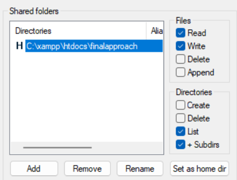

# Final-Approach
One of many JW Territory Manager based on Spring Boot, Angular, Openlayers and NitriteDB.

The application is intended to be run *"offline"*, not as a server, because it lacks user management and security functionality.

## Features
- Draw territories on a OpenStreetMap layer, assign number and name
- Assign territory to a preacher
- Register territory (as processed again by the preacher)
- Upload the assigned territory via FTP (SFTP) to your private hosted webpage
- Send a Whatsapp message with a list of assigned territories to a preacher
- Download maps as KML file
- Print statistics and tables (PDF)

## Development Environment
1) Download XAMPP (or set up your own Apache/PHP/FakeSftp Server)
2) Set the port in Apache to 90, at least not 80 as FM (Listen 90)
3) Change Setting in FinalApproach accordingly (FTP, User, PW, etc)
4) Start Apache and FileZilla

5) Setup a user in FileZilla

6) create inside the htdocs the following hierarchy of folders **"finalapproach/assets/data"**
7) Setup a folder in FileZilla (give read/write rights) and point it to a folder inside htdocs (or equivalent for your own Apache installation)

8) Now setup the settings inside FinalApproach accordingly

9) Upload the online website with the **UTILS / Upload TerritoryMapUI** button. You will see the angular application inside the folder.

10) Edit the index.html, set the correct base href to the ui (don't forget the last slash at the end)

11) Assign a territory to a user and then open the embedded map. You should see the map and you can also use the button **GO TO BIG MAP** for testing.

